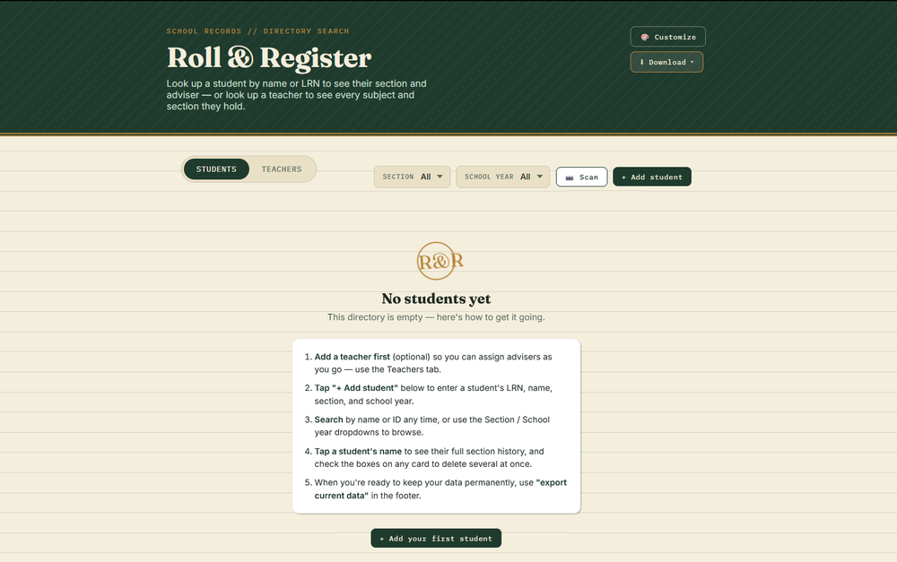
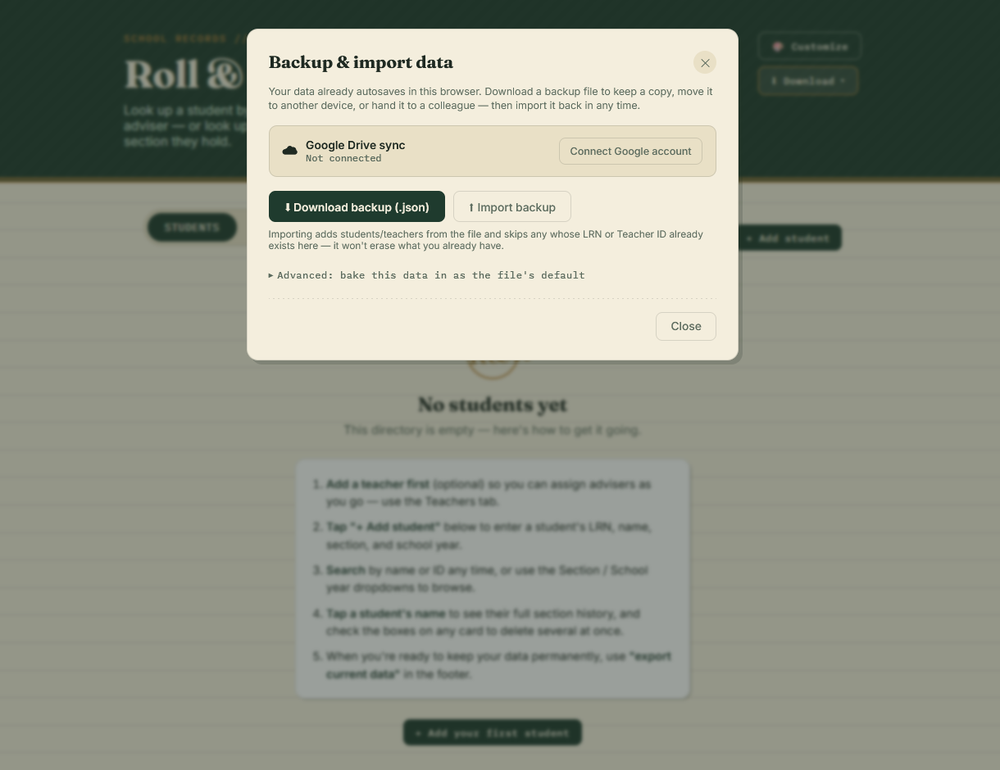
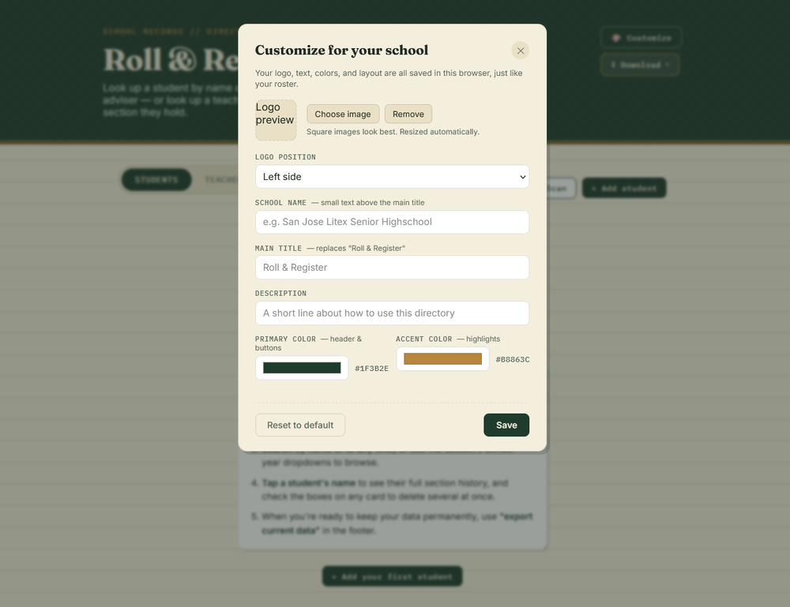

# 🎲 RollAndRegister

A cross-platform desktop and mobile application converted from the CC316 project web application. Built for school registrars to manage student and teacher records without the overhead of a full backend system.

---

## ✨ Features

### 🗂️ Student & teacher directory
- Add, edit, and delete student and teacher records, switchable via tabs.
- Instant search by name or ID, plus dropdown filters for Section and School year.
- Clean, printable-feeling layout designed around real registrar workflows.

### 📷 Camera scanning (OCR)
- Scan a printed ID or record to pre-fill the Add form — no typing needed.
- Scan a full printed class list at once; review every row before adding.
- Runs entirely on-device (Tesseract.js) — no photos are ever uploaded anywhere.
- Includes image preprocessing (contrast/adaptive thresholding) tuned for real classroom photo conditions, not just clean scans.

### 💾 Backup & data portability
- One-click backup to a `.json` file, and import it back in on any device.
- Import merges intelligently — adds new records and skips duplicates by ID, so it never overwrites existing data.
- Branding (see below) is included in every backup, so restoring a backup restores the look of the site too.

### ☁️ Google Drive sync (optional)
- Connect a Google account to back up automatically to that account's own Google Drive — no shared server, no third-party database.
- Auto-syncs a few seconds after any change; manual "Save to Drive" / "Load from Drive" buttons are also available.
- Uses Drive's private, hidden app-data storage — nothing is added to the account's visible Drive files, and the app can't see or touch anything else in that Drive.
- First connection safely merges in any existing backup before enabling auto-save, so a second device can't accidentally wipe out an existing roster.

### 🎨 White-label customization
- Upload your own school logo and choose its position in the header.
- Edit the site title, heading, and description.
- Set primary and accent colors to match your school's branding.

### 📱 Installable, offline-capable app
- Installable as a Progressive Web App on desktop or mobile straight from the browser.
- Service worker support for offline use once loaded.
- Native Windows (`.exe`) and Android (`.apk`) builds also available — see Downloads below.

### 🔒 Privacy by design
- All data lives in the browser (or the registrar's own Google Drive, if connected) — no central server, no third-party data collection.
- OCR scanning never leaves the device.

---

## 📸 Screenshots

<table>
  <tr>
    <td align="center" width="33%">
       
      Directory view — search, filters, and OCR scan
    </td>
    <td align="center" width="33%">
       
      Backup & import — Drive sync, download/import
    </td>
    <td align="center" width="33%">
       
      Customize — logo, colors, and branding
    </td>
  </tr>
</table>

---

## 🌐 Try Online First

Want to test the app without downloading anything? You can try out the live web version right in your browser:

👉 **[Launch RollAndRegister Web App](https://ivanclarklim2006-sudo.github.io/CC316-PROJECT/)**

---

## 📥 Downloads

Select your operating system below to download the latest executable binary:

| Platform | Format | Direct Download |
| :--- | :--- | :--- |
| **Web Browser** | Live Demo | [**Try Web Version**](https://ivanclarklim2006-sudo.github.io/CC316-PROJECT/) |
| **Windows 10/11** | Standalone Executable (`.exe`) | [**Download for Windows**](https://github.com/ivanclarklim2006-sudo/CC316-PROJECT/releases/download/PRE-Production/CC316-Project-win32-x64.zip) |
| **Android** | Package Installer (`.apk`) | [**Download for Android**](https://github.com/ivanclarklim2006-sudo/CC316-PROJECT/releases/download/PRE-RELEASE_TESTING/RollAndRegister.apk) |

 

### Quick Download Badges

&nbsp;

&nbsp;

---

## 🚀 Installation Instructions

<b>💻 Windows Installation</b>

1. Download **`CC316-Project-win32-x64.zip`** from the links above.
2. save the `.zip` file to your preferred folder or Desktop.
3. Extract **`CC316-Project-win32-x64.zip`** then click **`CC316-Project.exe`**  to open and run the app.

<b>📱 Android Installation</b>

1. Download **`RollandRegister.apk`** directly to your phone.
2. Open the file manager on your device and tap the downloaded `.apk`.
3. If prompted by Android, grant permission to **Allow installation from unknown sources**.
4. Complete the installation and open **RollAndRegister** from your app drawer.

